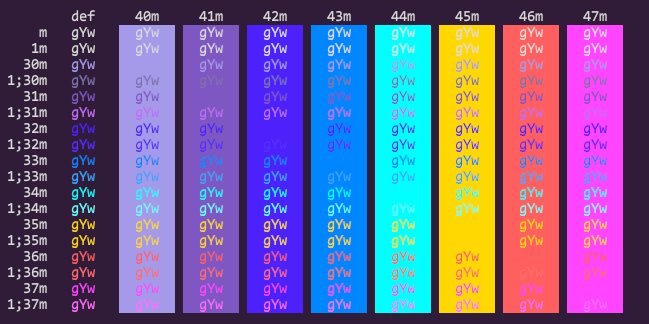

# true-konsole
a adaptation of true.vim to konsole terminal emulator

## Introduction

I've been using True theme to vim, but i'd like to use the same theme on Konsole, so i took some time to crete my own version inpired by the work of [megantiu](https://github.com/megantiu) on [true](https://github.com/megantiu/true.vim).

All the credits goes to @megantiu, i've just ported the colors to Konsole.

## Screenshot

## Instalation

1. Copy true.colorscheme to ~./local/share/konsole
2. Open Konsole and go to Settings>Edit Current Profile > Appearance
3. Chose true colorscheme from there

## Color pallete:

Color | Name | Usage
--- | --- | ---
**`#301b38`** | Background | Background
**`#dadada`** | Foreground | Foreground
**`#a599e9`** | Violet | Color1
**`#7e57c2`** | Deep Purple | Color2
**`#4d21fc`** | Indigo | Color3
**`#0087ff`** | Blue | Color4
**`#00ffff`** | Aqua | Color5
**`#ffd802`** | Amber | Color 6
**`#ff5f5f`** | Red | Color7
**`#ff45ff`** | Pink | Color8
